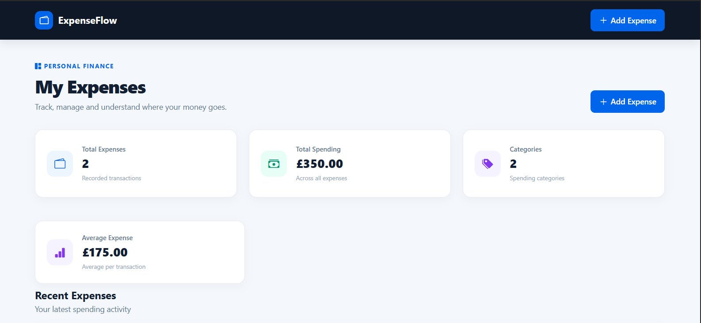
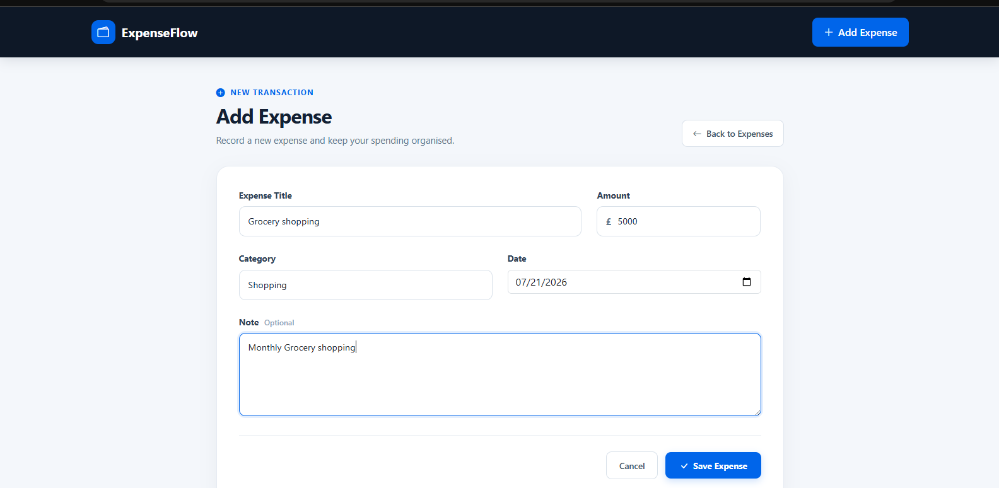
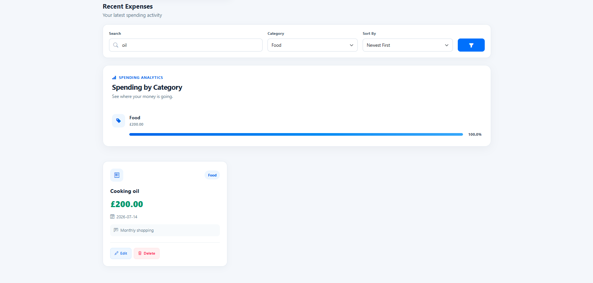
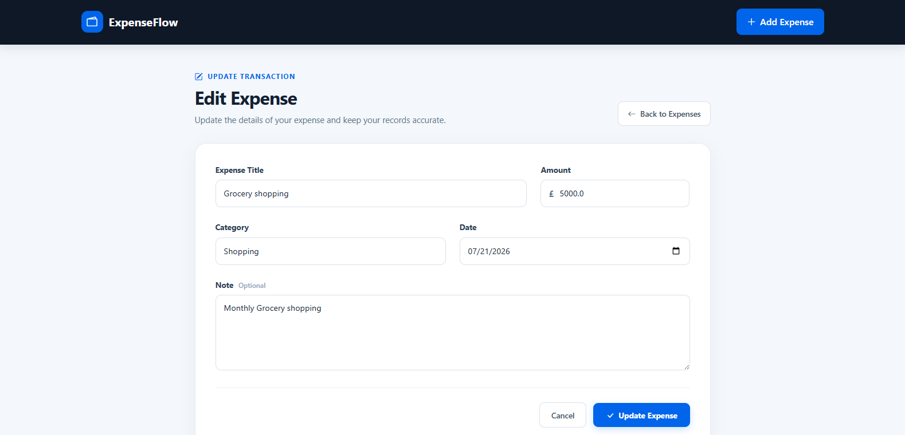
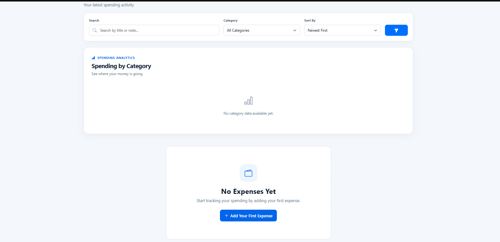

# 💰 ExpenseFlow

A modern and professional **Expense Tracking Web Application** built with Flask and SQLite. ExpenseFlow helps users record, manage, search, filter, and analyse their daily expenses through a clean and user-friendly dashboard.

---

## ✨ Features

- 📊 Dashboard with expense statistics
- 💰 Total spending calculation
- 🧾 Total expense records
- 📈 Average expense calculation
- 🏷️ Category-wise spending analytics
- ➕ Add new expenses
- ✏️ Edit existing expenses
- 🗑️ Delete expenses
- 🔍 Search expenses by title or note
- 🏷️ Filter expenses by category
- ↕️ Sort expenses by:
  - Newest First
  - Oldest First
  - Highest Amount
  - Lowest Amount
- 📅 Date validation
- 💷 Amount validation
- ⚠️ Form validation with user-friendly error messages
- 📱 Responsive and modern UI
- 🚫 Empty state when no expenses are available

---

## 🛠️ Tech Stack

- **Python**
- **Flask**
- **SQLAlchemy**
- **SQLite**
- **HTML5**
- **CSS3**
- **Bootstrap**
- **Jinja2**
- **Git & GitHub**

---

## 📸 Screenshots

### Dashboard



### Add Expense



### Search & Filter



### Edit Expense



### Empty State



---

## 📂 Project Structure

```text
expense_logger/
│
├── app/
│   ├── api/
│   │   └── routes.py
│   │
│   ├── main/
│   │   └── routes.py
│   │
│   ├── static/
│   │   └── style.css
│   │
│   ├── templates/
│   │   ├── 404.html
│   │   ├── 500.html
│   │   ├── base.html
│   │   ├── create.html
│   │   ├── edit.html
│   │   └── index.html
│   │
│   ├── __init__.py
│   ├── config.py
│   └── models.py
│
├── instance/
│
├── requirements.txt
├── run.py
├── README.md
└── .gitignore